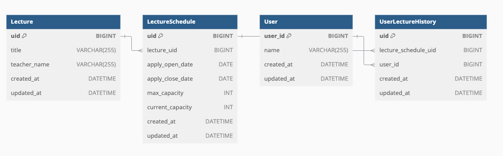

# 특강 신청 서비스
## 요구사항 정리
### 기능 별 정의

1️⃣ **특강 신청 API**

- 특정 userId 로 선착순으로 제공되는 특강을 신청하는 API
- **동일한 신청자는 동일한 강의에 대해서 한 번의 수강 신청**만 성공할 수 있습니다.
- 특강은 **선착순 30명만** 신청 가능합니다.
- **이미 신청자가 30명이 초과 되면 이후 신청자는 요청을 실패**합니다.

2️⃣ **특강 신청 가능 목록 API**

- 날짜별로 현재 신청 가능한 특강 목록을 조회하는 API
- 특강의 정원은 30명으로 고정
- 사용자는 각 특강에 신청하기 전 목록을 조회 가능

3️⃣  **특강 신청 완료 목록 조회 API**

- 특정 userId 로 신청 완료된 특강 목록을 조회하는 API
- 각 항목은 특강 ID 및 이름, 강연자 정보를 담고 있음

----------

## ERD 설계

### 테이블 설명

- **Lecture** : 특강 정보를 담고 있는 테이블
  - uid : pk 값
  - title : 특강 제목
  - teacher_name : 강사 이름
- **LectureSchedule** : 특강 일정 정보를 담고 있는 테이블
  - uid : pk 값
  - lecture_uid : fk 값 (Lecture 테이블의 uid)
  - apply_open_date : 특강 신청 시작일
  - apply_close_date : 특강 신청 마감일
  - max_capacity : 특강 최대 정원
  - current_capacity : 현재 신청된 특강 정원
- **User** : 사용자 정보를 담고 있는 테이블
  - uid : pk 값
  - name : 사용자 이름
- **UserLectureHistory** : 사용자의 특강 신청 정보를 담고 있는 테이블
  - uid : pk 값
  - user_uid : fk 값 (User 테이블의 uid)
  - lecture_schedule_uid : fk 값 (LectureSchedule 테이블의 uid)

### 설계 이유 
- **Lecture와 LectureSchedule의 분리**
  - 주요 요구사항에 따라 특강은 제목, 내용, 강사를 가지며 여러 개의 스케줄을 가질 수 있습니다. 따라서 특강 정보를 관리하는 Lecture 테이블과 일정 정보를 관리하는 LectureSchedule 테이블을 분리 설계하였습니다.
- **최대 정원 관리**
  - 특강 정원은 30명으로 고정되어 있으며, 사용자는 신청 가능한 목록을 조회할 수 있어야 합니다. 이를 위해 LectureSchedule 테이블에 max_capacity와 current_capacity 컬럼을 추가하였습니다.

- **중복 신청 방지** 
  - 동일한 학생이 동일한 특강을 여러 번 신청할 수 없도록 하기 위해 UserLectureHistory 테이블을 설계하였습니다. 
  - 이 테이블은 사용자와 특강 일정 간의 관계를 관리하며, 중복 신청을 방지하는 로직을 구현할 수 있도록 지원합니다.

- **날짜별 신청 가능 목록 조회**
  - 특강 신청 시작일(apply_open_date)과 마감일(apply_close_date) 컬럼을 LectureSchedule 테이블에 추가하여 날짜별로 신청 가능 목록을 조회할 수 있도록 하였습니다.
- **Lazy Join 적용**
  - LectureSchedule과 UserLectureHistory 등 엔티티 간 연관 관계에서 필요하지 않은 데이터를 즉시 로딩하지 않고 지연 로딩을 설정하여 성능을 최적화하였습니다.
  
- **동시성 제어**
  - 수강 신청 시 동시성 문제를 방지하고 데이터의 무결성을 보장하기 위해 비관적 락(PESSIMISTIC_WRITE) 을 사용하여 트랜잭션 내에서 정원 초과 여부를 제어합니다.